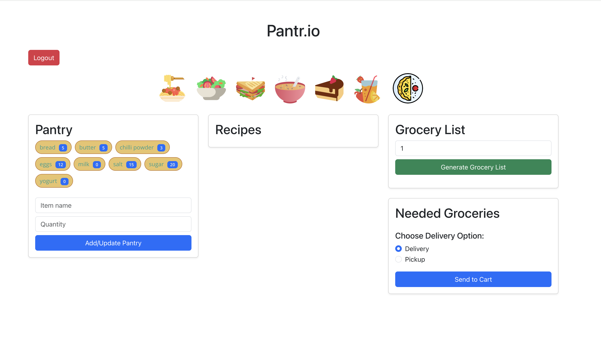
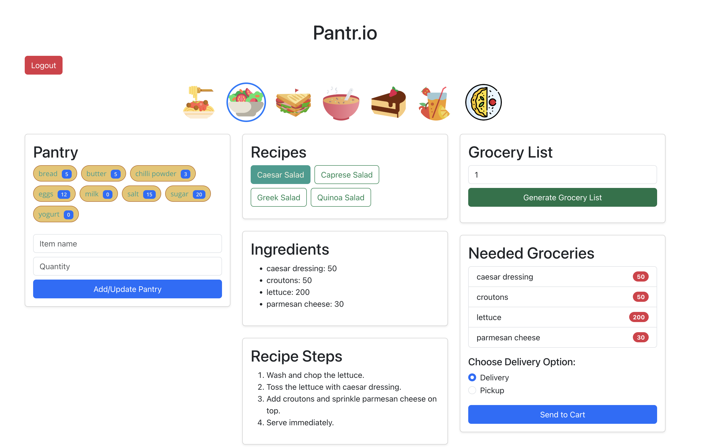

# Pantr.io

The Grocery List Generator is a web application that helps users manage their pantry, select recipes, and generate a grocery list based on the selected recipes and the number of servings. It consists of a **React frontend** and a **Flask backend**.

---

## App

### App After Login


### Grocery List Generation


---

## Features

- **Pantry Management**:
  - View current pantry items and their quantities.
  - Update pantry items directly from the backend.

- **Recipe Selection**:
  - View available recipes.
  - Select recipes to include in the grocery list.

- **Servings Input**:
  - Specify the number of servings to scale the ingredient quantities.

- **Grocery List Generation**:
  - Generate a grocery list based on selected recipes and servings.
  - View items that need to be purchased (needed groceries).

---

## Technology Stack

### Frontend
- **React**: For building the user interface.
- **Bootstrap**: For styling and responsive design.
- **Axios**: For making API calls to the backend.

### Backend
- **Flask**: For serving the API.
- **Flask-CORS**: For handling cross-origin requests.

---

## Setup Instructions

### Backend Setup
1. Navigate to the backend directory:
    ```bash
    cd /Users/urjasoni/Desktop/hypervelocity
    ```
   
2. Create a virtual environment:
  ```bash
    python3 -m venv venv
    source venv/bin/activate  # On macOS/Linux
  ```

3. Install dependencies:
  ```bash
    pip install flask flask-cors
  ```

4. Start the Flask server:
  ```bash
    pythons app.py
  ```

5. The backend will be available at `http://127.0.0.1:5000`.

### Frontend Setup

1. Navigate to the React project directory:
  ```bash
    cd /Users/urjasoni/Desktop/hypervelocity
  ```

2. Install dependencies:
  ```bash
    npm install
  ```

3. Start the React development server:
  ```bash
    npm start
  ```

4. Open your browser to go to 
  ```bash
    http://localhost:3000
  ```

### API Endpoints
#### Backend API
1. ***GET /api/pantry:***
  - Fetches the current pantry items and their quantities.

2. ***POST /api/pantry:***
  - Updates the pantry with a new item or quantity.

3. ***GET /api/recipes:***
  - Fetches the list of available recipes.

4. ***POST /api/grocery-list:***
  - Generates a grocery list based on selected recipes and servings.

### How to Use
1. ***View Pantry:*** The pantry section displays the current items and their quantities.

2. ***Select Recipes:*** Check the recipes you want to include in the grocery list.

3. ***Specify Servings:*** Enter the number of servings to scale the ingredient quantities.

4. ***Generate Grocery List:*** Click the "Generate Grocery List" button to view the grocery list and needed groceries.

---

### Future Enhancements

***User Authentication:***
Add user accounts to manage individual pantries.

***Search and Filter:***
Add search functionality for recipes and pantry items.

***Mobile-Friendly Design:***
Improve responsiveness for smaller screens.

***Cloud Integration:***
Store pantry and recipe data in Azure Cosmos DB or Azure SQL Database.

### Contributing

Contributions are welcome! Please follow these steps:

1. Fork the repository.
2. Create a new branch for your feature or bug fix.
3. Commit your changes and push the branch.
4. Submit a pull request.
